Онлайн агентство управляет заявками на услуги по организации мероприятий: свадьбы, корпоративы, дни рождения...

Вариант **23**: 10. ИБ ИЗ1 ПЗ2 Д10З2 Д10О5 Д2П1 Д2Б5 ОР1 ОД2

- ИБ — бесконечный источник
- ИЗ1 — пуассоновский источник для бесконечных, экспоненциальная задержка для конечных
- ПЗ2 — равномерный прибор
- Д1ОЗ2 — дисциплины буферизации в порядке поступления
- Д1ОО5 — дисциплины отказа - вновь пришедшая
- Д2П1 — приоритет дисциплин постановки по номеру прибора
- Д2Б5 — приоритет дисциплин постановки  по номеру источника, заявки в пакете
- ОД2 — формализованная схема модели, текущее состояние
- ОР1 — сводная таблица результатов

Блок-схема

**Диаграмма классов**

- **Client (Клиент)**:
    - Представляет физических или юридических лиц
    - Содержит базовую информацию о клиенте
    - Метод `SubmitApplication()` для подачи заявки
- **Application (Заявка)**:
    - Хранит детали мероприятия: тип, дата, количество гостей
    - Содержит специфические требования
    - Имеет метод валидации `Validate()`
- **Buffer (Буфер)**:
    - Реализует очередь заявок по принципу FIFO
    - Ограничен максимальным размером
    - Методы добавления, удаления и очистки старых заявок
- **ApplicationDispatcher (Диспетчер постановки)**:
    - Управляет буфером заявок
    - Распределяет заявки между менеджерами
    - Обрабатывает переполнение буфера
- **ManagerSelector (Диспетчер выборки)**:
    - Выбирает менеджера для обработки заявки
    - Рассчитывает приоритет менеджера на основе загрузки и квалификации
- **EventManager (Менеджер по организации мероприятий)**:
    - Имеет специализацию и уровень квалификации
    - Ограничен максимальной нагрузкой
    - Методы проверки возможности принять заявку и обработать её

Сиквенс-диаграмма

- Пользователь подает заявку
- Диспетчер проверяет буфер
- Если место есть – находит преподавателя
- Если нет места – добавляет в очередь
- При переполнении буфера удаляются старые заявки

BPMN диаграмма

